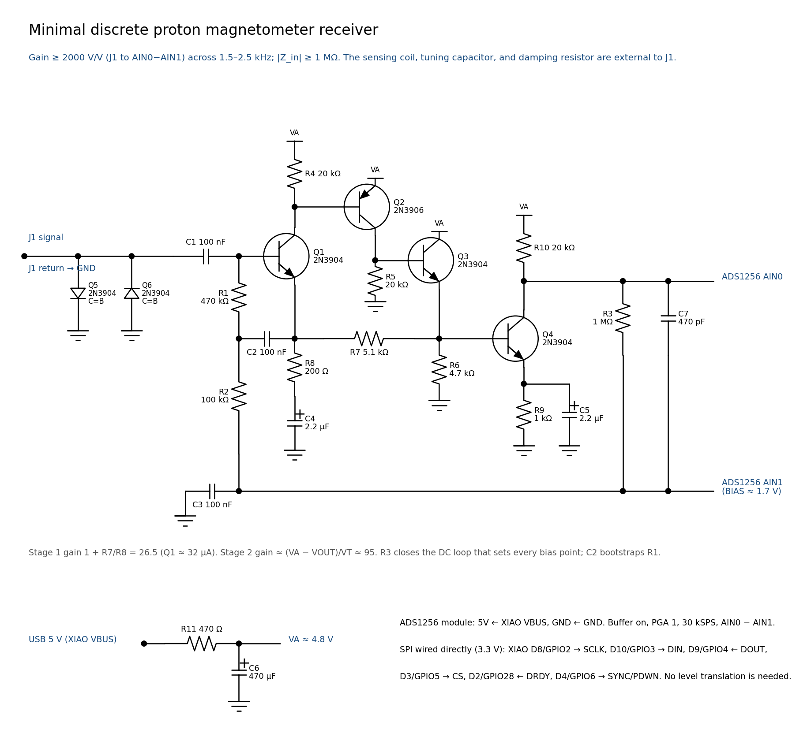
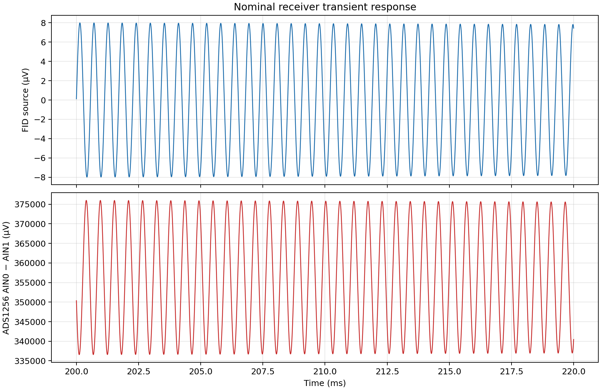
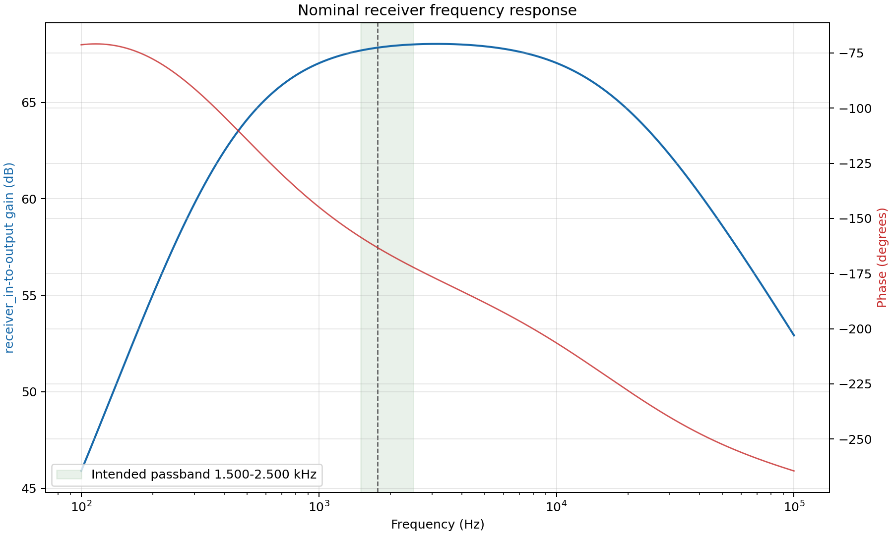

# Proton magnetometer

- One receiver, one external coil assembly, one frequency estimator
- USB-powered bench instrument
- Target: proton free-induction decay around 35–59 µT
- The figures below are ngspice calculations, not bench measurements

---

# Circuit boundary

- The external assembly contains the sensing coil, tuning capacitor, and damping switch
- J1 is the receiver boundary; the receiver contains no LC tank
- A minimal discrete transistor amplifier drives the already purchased HiLetgo ADS1256 module
- The already purchased XIAO RP2350 connects directly to the ADC's SPI and estimates frequency
- Every other fitted part is one of 24 Thomson kit parts in `new_allowed_components.json`

---

# Analog chain

- Diode-connected 2N3904 clamps at J1 (femtoamp leakage), 100 nF coupling
- Stage 1, ×26.5: low-noise 2N3904 input at 32 µA, 2N3906 gain stage, 2N3904 follower
- Stage 2, ×95: one common-emitter 2N3904 driving AIN0 directly
- One DC loop (R3) sets every bias point; its filtered node is also AIN1
- Bootstrapped bias resistor, and a stage-1 loop gain near 40, give megohm input impedance
- ADS1256: AIN0 − AIN1, buffer on, PGA 1, 30 kSPS

---

# Simulated performance

- 2425–2514 V/V from J1 across 1.5–2.5 kHz; at least 2122 V/V at the worst combined corner
- |Z_in| 2.10–2.19 MΩ; at least 1.51 MΩ with transistor beta halved
- 3.59 nV/√Hz with the untuned coil: frequency CRB 0.02 nT (3.59 µV FID) or 0.17 nT (0.41 µV)
- 1.3 dB noise figure against the 30 kΩ tuned-sensor fixture
- ADS1256 noise at PGA 1 is about 4.5 nV referred to J1; the sinc filter rejects aliases

---

# Simulated transfer

- Example source: 10 µV peak through a provisional 30 kΩ external source impedance
- The nominal 3.59 µV FID becomes about 9 mV peak at the ADC
- These plots exclude converter noise, digital filtering, and coil resonance

---

# Digital interface and blanking

- SPI wires run directly from the XIAO to the module; ADS1256 inputs accept 5.25 V and its outputs stay at or below DVDD
- Measure the module's DRDY high level (about 3.3 V) before connecting
- Firmware drives CS and SYNC/PDWN high, then waits for DRDY
- Discard the blank, then pulse SYNC/PDWN briefly and wait for valid DRDY
- Verify the purchased module's physical header order before wiring

---

# Estimator

- Portable C99 core in `frequency_estimator_firmware/core`
- Goertzel seed, baseband mixing, FIR decimation, decay weighting, and zoom frequency fit
- Up to 45,000 samples in 1.5 s at 30 kSPS
- SPI acquisition, blanking control, and USB reporting firmware remain to be written

---

# Bench gates

- Measure the actual polarizer turnoff voltage before connecting the sensor; verify Q5/Q6 clamp current
- Measure stage bias points, gain, passband, input noise, loading, and recovery
- Check the module DRDY level and scope SPI at the selected clock
- Verify frequency repeatability and gross error rate with a wet FID
- There is no accepted PCB or fabrication DRC result
