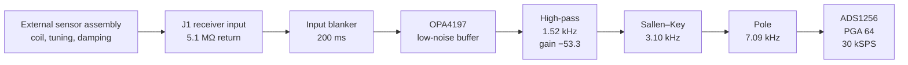
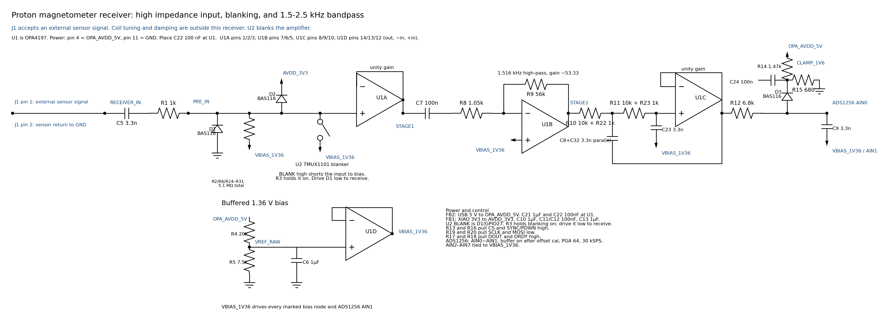

# Receiver

- The receiver starts at J1; coil tuning and damping stay in the external assembly
- The fixed filter passes example inputs at 1765 and 2129 Hz
- About 37 V/V receiver input-to-ADC gain at either frequency, before the PGA

---

# Analog stages

- U1A is the unity-gain low-noise first stage
- U1B's 1.52 kHz high-pass attenuates 50/60 Hz
- Sallen–Key natural frequency is 3.10 kHz
- The receiver adds no LC resonance

---

# Construction schematic

- J1 external input, OPA4197 signal path, blanker, and 1.36 V bias
- AIN0 clamp is D3 with R14, R15, and C24
- ADS1256 PGA is on the module

---

# Transient response

- Simulated 10 µV input through 30 kΩ external source impedance
- Differential ADC input peak is about 0.30 mV in the 200–220 ms window
- PGA 64 full scale is ±78 mV

---

# Frequency response

- Simulated receiver gain is 37.3 V/V at 1765 Hz and 37.6 V/V at 2129 Hz
- The response excludes external coil tuning and damping
- 30 kHz is far below the receiver passband

---

# ADC input

- Differential AIN0 − AIN1, buffer on, PGA 64, 30 kSPS
- Signal bias is 1.36 V, inside the op-amp’s low-noise common-mode range
- ADC reference stays 2.5 V; full scale is ±78 mV
- Clamp cathode is 1.58 V, so the diode is off in normal operation
- A 5.25 V saturated output leaves AIN0 around 2.74 V in the nominal divider model

---

# Frequency estimator

- One record, up to 1.5 s at 30 kSPS
- Full-rate samples are not stored; only the decimated envelope is kept

---

# Estimator algorithm

- Seed: Goertzel over 500–3500 Hz, then a 3-bin parabolic refine
- Mix with a digital oscillator at that seed
- Low-pass and decimate by 10
- Fit the envelope decay, and weight the tail down
- Scan residual frequency at 0.02 Hz steps
- Parabolic refine of the zoom peak
- A peak on either end of the seed band or the ±20 Hz grid is rejected

---

# What the estimate is

- Output is frequency in hertz
- 1 nT is 0.0426 Hz at the shielded-proton scale
- Host check: float path matches an independent mirror to 0.01 Hz
- The synthetic records do not include this receiver’s transfer function
