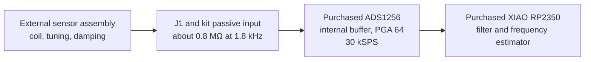

# Receiver

- The receiver starts at J1; coil tuning and damping remain external.
- The ADS1256 internal buffer is the first active stage. No external analog amplifier or LC tank is fitted.
- The passive path has approximately unity gain in the FID region; the converter noise limits sensitivity.

---

# Lab parts

- 22 nF coupling capacitor, 10 kΩ series resistor, 2 MΩ bias return, and 100 pF shunt capacitor
- Two 1N4148 diodes clamp AIN0 near the 1.60 V bias
- Six 2N3904 transistors and six more 1N4148 diodes translate SPI levels
- No additional online component order is specified; the ADC and XIAO are already purchased

---

# Sensitivity and blanking

- TI lists 1.742 µV RMS ADC input noise at 30 kSPS, PGA 64, and buffer enabled
- A nominal 3.59 µV peak coil signal gives about 6 dB peak-amplitude SNR per sample before other noise
- XIAO discards the first 200 ms of samples, then briefly pulses SYNC/PDWN to restart the digital filter
- The polarizer turnoff pulse and actual recovery require measurement before sensor hookup

---

# Simulated analog transfer

- Example 10 µV source through provisional 30 kΩ external source impedance
- The receiver's analog path has no narrow bandpass or voltage gain
- The model excludes ADC noise, digital filtering, and external coil resonance

---

# Frequency estimator

- One record of up to 1.5 s at 30 kSPS
- The estimator core exists; ADS1256 SPI acquisition and USB reporting remain to be written
- The 1 nT repeatability target is not established for this lower-sensitivity analog path
