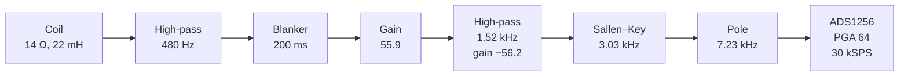

# Receiver

- Untuned coil, so 1.7 kHz and 2.1 kHz both pass
- About 2000 V/V from coil to the ADC pins, before the PGA
- Passband 1.5–2.5 kHz

---

# Analog stages

- High-pass before gain, so 50/60 Hz is attenuated first
- U1A and U1B set 55.9 × 56.2 = 3141 V/V
- Filters bring the 1.5–2.5 kHz band down to about 2000 V/V
- Sallen–Key natural frequency is 3.03 kHz
- No notch at 1.8 kHz; that is a valid proton signal

---

# Construction schematic

- OPA4197 signal path, blanker, and 1.50 V bias
- AIN0 clamp is D3 with R14, R15, and C24
- ADS1256 PGA is on the module, not on this drawing

---

# Transient response

- Simulated, not measured
- About 1 µV peak at the coil, 2128.8 Hz
- Differential ADC input settles near ±2.0 mV
- PGA 64 full scale is ±78 mV

---

# Frequency response

- Simulated, not measured
- In-band gain 1924–2032 V/V
- 2020 V/V at 2128.8 Hz
- 7.3 V/V at 30 kHz, 49 dB below the passband

---

# ADC input

- Differential AIN0 − AIN1, buffer on, PGA 64, 30 kSPS
- Signal bias is 1.50 V, inside the op-amp’s low-noise common-mode range
- ADC reference stays 2.5 V; full scale is ±78 mV
- Clamp cathode is 1.80 V, so the diode is off in normal operation
- A 5 V saturated output leaves AIN0 at or below 2.76 V, under the 3.0 V buffer limit

---

# Frequency estimator

- One record, up to 1.5 s at 30 kSPS
- Full-rate samples are not stored; only the decimated envelope is kept

---

# Estimator algorithm

- Seed: Goertzel over 500–3500 Hz, then a 3-bin parabolic refine
- Mix with a digital oscillator at that seed
- Low-pass and decimate by 10
- Fit the envelope decay, and weight the tail down
- Scan residual frequency at 0.02 Hz steps
- Parabolic refine of the zoom peak
- A peak on either end of the seed band or the ±20 Hz grid is rejected

---

# What the estimate is

- Output is frequency in hertz
- 1 nT is 0.0426 Hz at the shielded-proton scale
- Host check: float path matches an independent mirror to 0.01 Hz
- The synthetic records do not include this receiver’s transfer function
