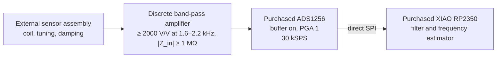

# Receiver

```mermaid
flowchart LR
  ext["External sensor assembly<br/>coil, tuning, damping"] --> amp["Discrete band-pass amplifier<br/>≥ 2000 V/V at 1.6–2.2 kHz, |Z_in| ≥ 1 MΩ"]
  amp --> adc["Purchased ADS1256<br/>buffer on, PGA 1<br/>30 kSPS"]
  adc -->|direct SPI| xiao["Purchased XIAO RP2350<br/>filter and frequency estimator"]
```

- The receiver starts at J1; coil tuning and damping remain external.
- 36 lab parts: six gain and filter transistors, two transistor clamps, 17 resistors, and 11 capacitors.
- `make verify` fails if gain, input impedance, noise, or interference requirements are missed at any of nine corners.

---

# Lab parts

- Stage 1 ×35 with a 26 µA 2N3904 input; stage 2 is one common-emitter stage, ×100
- Fourth-order band-pass between the stages, so interference is filtered before the high-gain stage
- A single DC loop sets every bias point; its filtered node doubles as ADS1256 AIN1
- R11/C6 filter USB 5 V into the 4.7 V analog rail; total draw is 0.6 mA
- No level translators: the XIAO drives the ADS1256 SPI directly

---

# Sensitivity and blanking

- Simulated input noise: 4.1 nV/√Hz with the untuned coil, 25.4 nV/√Hz with a 30 kΩ source
- Frequency CRB with the untuned coil: 0.02 nT for the 3.59 µV FID, 0.20 nT for 0.41 µV; target 1 nT
- XIAO discards the blank, then briefly pulses SYNC/PDWN to restart the digital filter
- Simulated recovery from a ±10 V input pulse reaches 10 mV within about 75 ms

---

# Simulated analog transfer

- Example 10 µV source through provisional 30 kΩ external source impedance
- 3034–3155 V/V across 1.6–2.2 kHz; −3 dB at 1.15 and 3.1 kHz; |Z_in| 1.8–2.5 MΩ
- The model excludes ADC noise, digital filtering, and external coil resonance

---

# Frequency estimator

```mermaid
flowchart LR
  mean["Remove mean"] --> seed["Goertzel seed<br/>8192 samples"]
  seed --> mix["Mix to<br/>baseband"]
  mix --> fir["33-tap FIR<br/>decimate ÷10"]
  fir --> tau["Decay time"]
  tau --> zoom["Weighted zoom<br/>±20 Hz"]
  zoom --> hz["Frequency"]
```

- One record of up to 1.5 s at 30 kSPS
- The estimator core exists; ADS1256 SPI acquisition and USB reporting remain to be written
- The 1 nT repeatability target is not established for this lower-sensitivity analog path
