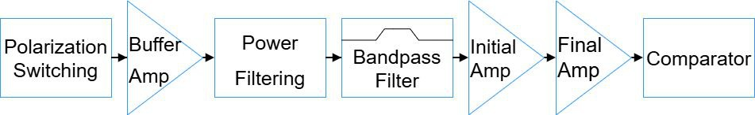
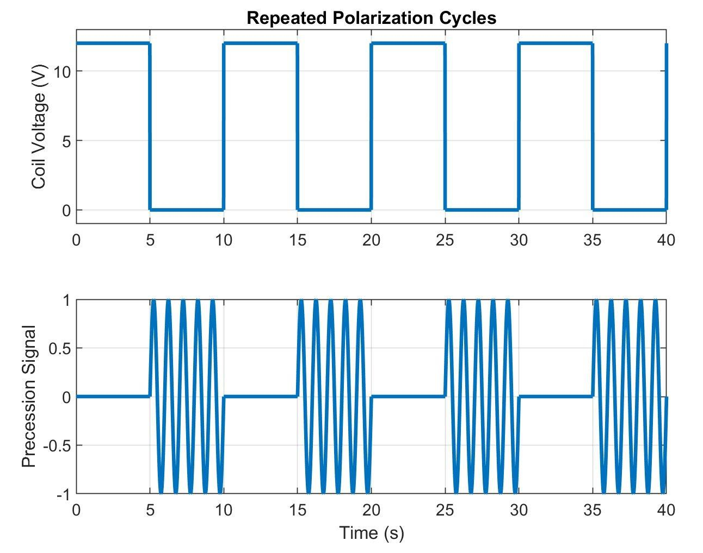
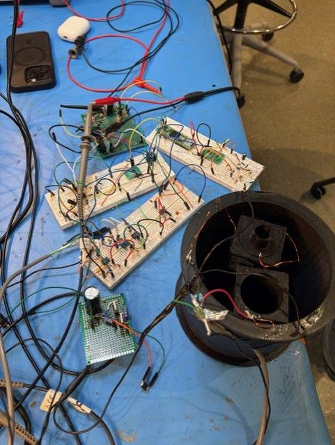
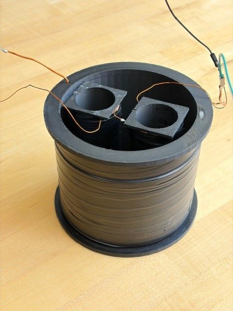
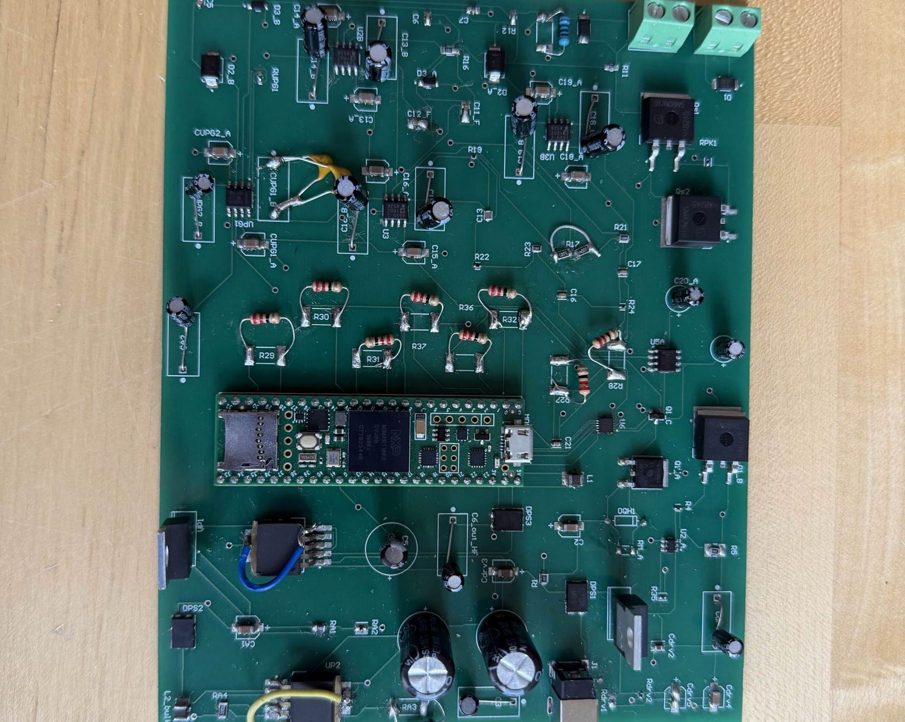
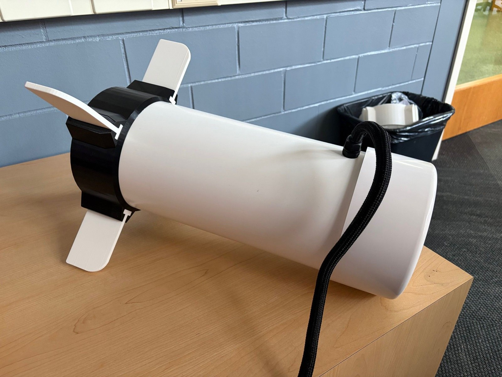
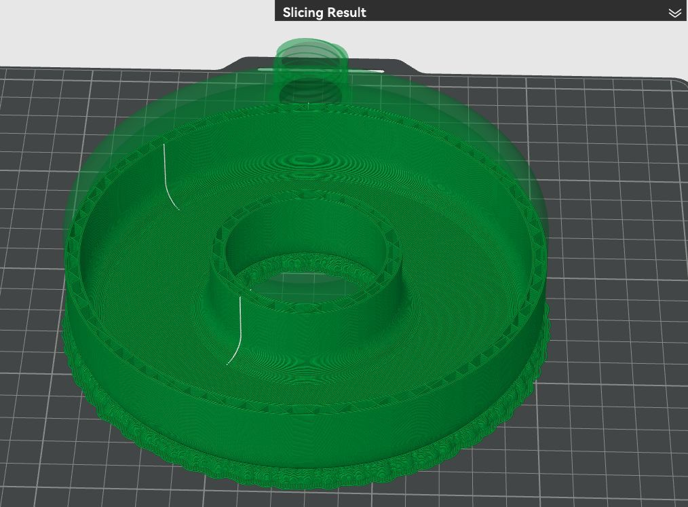
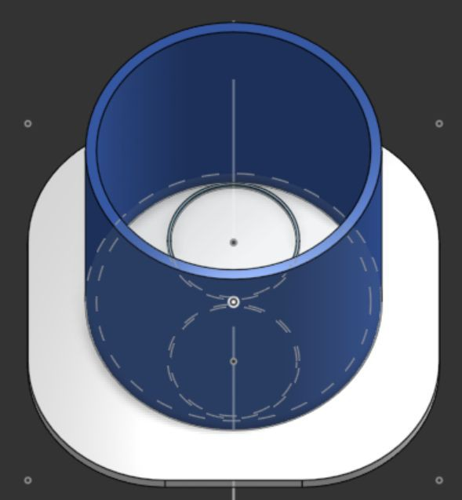
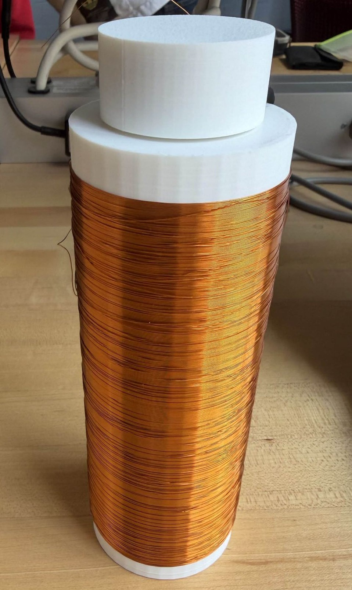

# Prior work review, ECE 455 proton magnetometer towfish

**Week 2 status review.** Sources: four student-team final decks from the SP26 capstone offering
(*The Larmor Lads*, *Hook Line & Towfish*, *Tow-fish & Furious*, *Finding Titan*) plus a Fall-2025
feasibility memo ("Magnetometer Detection Assessment – Vietnam Aircraft Recovery", 24 Oct 2025).
All figures referenced below were extracted from those decks into `figures/`.

---

## 1. Problem framing (from the feasibility memo)

The memo scoped the mission. Find Vietnam-era aircraft wreckage, 2,500 to 4,000 kg of ferromagnetic
material per fighter, in shallow coastal water where sediment buries the target and optics and sonar fail.
Key numbers that set the engineering target:

- Calibration rule of thumb, 1,000 kg of steel gives about 1 nT of anomaly at 30 m (dipole, cube-root scaling).
- Detection ranges, about 45 to 74 m for a whole aircraft (3,500 to 3,800 kg) at 0.25 nT and 27 to 47 m
  at 1 nT (memo table; its summary rounds these to 40 to 70 m for complete aircraft, 25 to 45 m for major
  components).
- Static fields penetrate seawater without attenuation, so a surface-towed sensor works at 0 to 100 m depth.
- Commercial baselines cost $20K to $60K (JW Fishers Proton 5, Geometrics G-882), which set the capstone
  goal of a low-cost proton precession magnetometer (PPM) towfish with better than 1 nT sensitivity.

## 2. Architecture all four teams converged on

Polarize (DC pulse through a coil around a proton-rich fluid) → abruptly switch off → protons precess
about Earth's field, inducing a decaying 1 to 2.8 kHz sinusoid (the free induction decay, FID) in a pickup
coil → amplify and filter → measure frequency → `B = f / γp` (γp ≈ 42.577 Hz/nT) → GPS-tag and log to SD.

## 3. Progress actually achieved

| Subsystem | What was demonstrated |
|---|---|
| Polarization switching | Every team demonstrated MOSFET and gate-driver pulsing (5 s ON/OFF cycles on one team, 0.8 s polarization in a 2.8 s cycle on another; 12 to 24 V pulses at 1.2 to 10 A; one 4.7 A pulse with minimal ringing). Flyback/TVS diodes and RC snubbers clamped the back-EMF. |
| Coils | 3D-printed forms, winding chucks, and turn counting. Teams iterated toroid, then solenoid, then a final geometry (3-coil, series-opposed pair, or bottle-in-bottle). Opposed and dummy coils cancel common-mode noise. |
| Analog front end | Teams verified stage-by-stage gain with function generators, a 2000x chain (Finding Titan) and 0.3 mV to 1.5 V, about x5k (Tow-fish & Furious), using AD620/INA828 instrumentation front ends, 850 Hz to 5 kHz (Hook Line) and 800 Hz to 4 kHz (Finding Titan) bandpasses, and a DG419 blanking switch (Finding Titan). |
| Frequency measurement | Teams showed MCU timer counting and DFT/FFT are insufficient and replaced them with FPGA+TCXO reciprocal counting (2208 Hz in, 2207.99 Hz out), RP2040 PIO comparator counting (about 0.3 nT claimed), and zero-crossing interpolation. |
| Data and GPS | All teams logged SD-card CSV with GPS metadata and verified modular firmware (state machine, estimator, GPS parser, logger) against synthetic signals. |
| Mechanical | Teams designed towfish housings (6" and 8" PVC, 3D-printed caps, O-ring/FlexSeal/MarineWeld seals, fins, internal sleds). At least two built physical prototypes. |
| PCBs | Teams fabricated several boards, a polarization board, a frequency/GPS board, a 4-layer signal board, a 10-module monolithic board, and a multi-board set. |

Representative hardware:

## 4. Problems with the previous designs / why they fell short

### 4.1 No team ever captured a real proton FID
Every reported result came from a function generator, a driven test coil, or a hand-moved magnet. None came
from the actual decaying proton signal in the team's own sensor fluid. Each team proved the analog chain,
comparator, and firmware in isolation on clean synthetic inputs, but nobody closed the end-to-end physics
link from fluid to microvolt FID to frequency. This is the largest gap in the prior work.

### 4.2 Noise floor and prototyping platform
- Breadboard/perfboard parasitics and contact noise masked µV-level signals (explicitly called out by
  Larmor Lads and Finding Titan).
- Power-supply ripple fell inside the 2.1 kHz Larmor band, so filtering could not remove it.
- 60 Hz and ~60 kHz environmental pickup; long tow-cable acting as an antenna (motivating instrumentation amps).
- Discrete op-amp chains (e.g. 3× TL072) had too high a noise floor and poor CMRR; teams had to pivot to
  AD620 / INA828 instrumentation front ends. Gain distribution was also wrong (too much early gain
  amplifies noise before the FID is isolated).

### 4.3 Pulse-to-receiver coupling and ringing
- The high-current polarization transient rings and couples into the pickup coil, saturating or damaging
  the front end. Blanking (DG419) helped, but its timing is a knife-edge. Too short and the transient
  overloads the front end; too long and the short-lived FID is already gone.
- Magnetic self-interference from high-current loops and poor physical layout; coils placed near analog
  circuitry oscillated. Separation, shielding, and series-opposed dummy coils helped (Finding Titan's
  dummy-coil pair reduced noise as intended), but improved differential matching was still left as
  future work.

### 4.4 Coil geometry churn and fluid sealing
- Every team abandoned the toroid. It is impractical to wind because the whole spool must pass through the
  bore, and the turns-versus-resistance conflict (polarization wants thick wire and few turns, sensing wants
  thin wire and many turns) made a combined toroid infeasible at about 5,000 turns and unsafe power.
- Early solenoids too large to fit the towfish and prone to leaking; sealing the proton fluid
  (water/kerosene) in 3D-printed forms required epoxy/threaded-cap iterations.
- Final geometries diverged (3-coil, opposed pair, bottle-in-bottle). No team settled the coil design from
  first principles; each re-derived it under time pressure.

### 4.5 PCB bring-up failures, especially the monolithic board
Tow-fish & Furious put all ten modules on one PCB and paid for it.
- The -5 V analog rail clamped at about 3.2 V because of regulator routing and enable errors on both LM2596 buck converters.
- Polarized capacitors on the analog rail were reversed or substituted incorrectly.
- A Teensy RX1/ADC_CNV pin measured about 1 ohm to ground, a latch-up risk, with suspected secondary damage to the ADC and reference.
- The team did not finish debugging by semester end. Their own slides say it plainly, "don't put everything on one PCB."
Hook Line & Towfish also shipped ordering errors (Coil+ pour, MOSFET-source pour) which they fixed by
scraping solder mask and bodge-wiring. Teams repeatedly tested power circuitry last because those parts had
long lead times.

### 4.6 Frequency-measurement precision vs. the <1 nT goal
- MCU gate counting: ±1 count + clock error ⇒ only 1–20 Hz accuracy (need <0.04 Hz for <1 nT).
- FFT: Δf = 1/T, and the FID lasts 1–3 s ⇒ ~1 Hz resolution; 0.04 Hz would need a 25 s record.
- The workarounds (FPGA+TCXO reciprocal counting, PIO, zero-cross interpolation) are sound, but teams
  validated them only on clean synthetic waveforms, never on a real, noisy, decaying FID.

### 4.7 Integration, timing, and schedule
- Teams left polarization, blanking, sampling, and GPS synchronization unfinished and flagged it as future work.
- FPGA and Teensy desync produced repeated "measurement timed out" errors.
- Teams often designed housings but did not build them, tested power stages only after the PCB arrived, and
  ran out of semester before full system integration.

## 5. Per-team outcome snapshot

| Team | Coil | Front end | Frequency | Outcome |
|---|---|---|---|---|
| Larmor Lads | toroid, then 3-coil | TL072 chain, then AD620 | FPGA + TCXO reciprocal | Polarization and frequency boards work; no real FID; amplifier noise fixed only after the AD620 pivot |
| Hook Line & Towfish | opposed pair, 530 turns | buffer, BPF, two amps, comparator | RP2040 PIO | Built the full signal PCB and towfish; fixed PCB errors by bodge; no real FID |
| Tow-fish & Furious | bottle-in-bottle solenoids | INA828, ADA4898 BPF and gain, 24-bit ADC | zero-crossing on Teensy | Verified the analog chain at x5k; the monolithic PCB power-rail failure stayed unresolved |
| Finding Titan | polarization coil plus series-opposed pair | blanking, preamp, BPF, 100x post-amp (~2000x chain) | comparator plus Teensy zero-cross | Verified every block on synthetic inputs; never saw a proton signal; limited by breadboards |

## 6. Open problems to attack this semester (in priority order)

1. Close the physics loop on the bench first. Put a real coil and fluid on the scope with proper blanking
   and capture a genuine decaying FID before touching integration, PCBs, or the towfish.
2. Leave breadboards early. Separate pulse and analog domains, use a star ground, twisted and shielded coil
   leads, and physical separation between coil and electronics.
3. Blank with a timed analog switch and damp ringing at the source with a TVS diode, snubber, and matched
   dummy coil.
4. Test power regulation standalone with the final parts before fabrication. Use modular boards rather than
   one monolithic board, and add test points, fuses, current limiting, and rail LEDs.
5. Fix the gain and noise budget with an instrumentation front end, band-limited gain, and no excess gain
   ahead of the bandpass.
6. Validate the frequency estimator against a traceable reference and on real, noisy FID records.
7. Settle on one windable, sealable coil geometry and match opposed coils by measured resistance and
   inductance.
8. Order long-lead parts early and build the housing in parallel with the electronics.

---

## Appendix, figure index extracted from the past-work decks

| File | Content |
|---|---|
| `figures/finding-titan_assembled-breadboards.jpg` | Multi-board breadboard prototype |
| `figures/finding-titan_coil-assembly.jpg` | Polarization + opposed sensing coils |
| `figures/finding-titan_coil-orientation-cad.jpg` | Down-facing coil holder concept |
| `figures/finding-titan_comparator-square-wave.jpg` | Comparator digitization to square wave |
| `figures/finding-titan_measurement-state-machine.jpg` | Measurement logic block diagram |
| `figures/finding-titan_power-pcb.jpg` | Power / ground-rail PCB |
| `figures/finding-titan_preamp-output.jpg` | Blanked preamp output (synthetic) |
| `figures/finding-titan_sensing-coil-response.jpg` | Sensing-coil response to driven coil |
| `figures/finding-titan_towfish-physical.jpg` | Built 6in PVC towfish |
| `figures/finding-titan_towfish-skeleton-cad.jpg` | Towfish internal skeleton CAD |
| `figures/hook-line_bandpass-response.jpg` | Bandpass filter response |
| `figures/hook-line_coil-housing-cad.jpg` | Coil housing CAD |
| `figures/hook-line_fluid-container-cad.jpg` | Proton-fluid container CAD |
| `figures/hook-line_opposed-coil-field-sim.jpg` | Field simulation of opposed windings |
| `figures/hook-line_pcb-3d.jpg` | 4-layer PCB 3D render |
| `figures/hook-line_pcb-sections.jpg` | Sectioned PCB layout |
| `figures/hook-line_polarization-concept.jpg` | Proton alignment concept |
| `figures/hook-line_signal-chain-block-diagram.jpg` | Full analog signal chain |
| `figures/hook-line_software-architecture.jpg` | Pi Pico + Pi Zero software architecture |
| `figures/hook-line_towfish-cad.jpg` | Towfish CAD |
| `figures/hook-line_towfish-internal.jpg` | Opened towfish hull (internal view) |
| `figures/hook-line_wound-coil.jpg` | Wound sensing coil |
| `figures/larmor-lads_assembled-pcb-bottom.jpg` | Assembled frequency/GPS PCB (bottom) |
| `figures/larmor-lads_assembled-pcb-top.jpg` | Assembled frequency/GPS PCB (top) |
| `figures/larmor-lads_function-generator-demo.jpg` | 2.208 kHz synthetic test input |
| `figures/larmor-lads_mosfet-breadboard-demo.jpg` | MOSFET switching breadboard demo |
| `figures/larmor-lads_opamp-chain-schematic.jpg` | Failed 3-stage TL072 amplifier schematic |
| `figures/larmor-lads_polarization-block-diagram.jpg` | Polarization subsystem block diagram |
| `figures/larmor-lads_polarization-cycles.jpg` | Polarization pulse / FID waveform overview |
| `figures/larmor-lads_polarization-pcb-2d.jpg` | Polarization board 2D layout |
| `figures/larmor-lads_polarization-pcb-3d.jpg` | Polarization board 3D render |
| `figures/larmor-lads_solenoid-field-diagram.jpg` | Solenoid field / coil-orientation reference |
| `figures/larmor-lads_three-coil-configuration.jpg` | Final 3-coil (pol + sensor + cancel) layout |
| `figures/larmor-lads_toroid-cad.jpg` | Abandoned toroid CAD |
| `figures/towfish-furious_analog-chain-output.jpg` | x5k analog chain output (synthetic input) |
| `figures/towfish-furious_assembled-pcb.jpg` | Monolithic 10-module PCB (as built) |
| `figures/towfish-furious_coil-winding.jpg` | Coil winding setup |
| `figures/towfish-furious_csv-output.jpg` | Logged CSV (synthetic signal + real GPS) |
| `figures/towfish-furious_final-coil-bottle-cad.jpg` | Final threaded coil-bottle CAD |
| `figures/towfish-furious_firmware-architecture.jpg` | Modular Teensy firmware architecture |
| `figures/towfish-furious_sensing-coil-bottle.jpg` | Sealed sensing-coil bottle |
| `figures/towfish-furious_signal-block-diagram.jpg` | Receiver block diagram |
| `figures/towfish-furious_solenoid-cad.jpg` | Original solenoid CAD (abandoned) |
| `figures/towfish-furious_system-architecture.jpg` | Towfish-to-boat system architecture |
| `figures/towfish-furious_toroid-cad.jpg` | Original toroid CAD (abandoned) |
