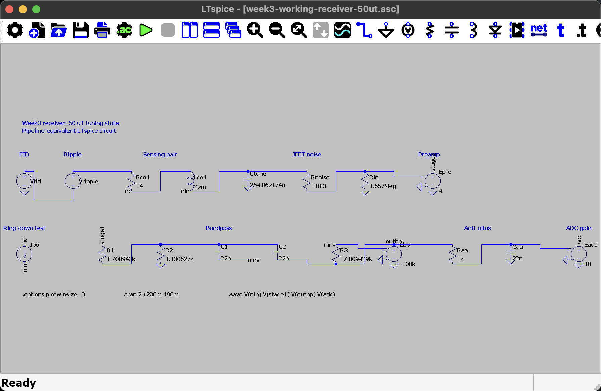
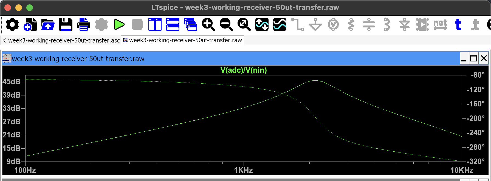
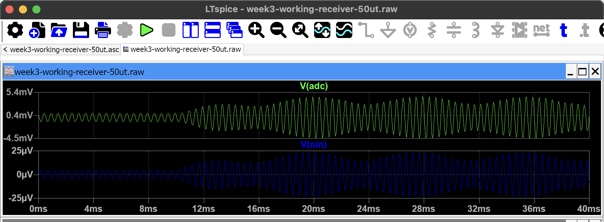
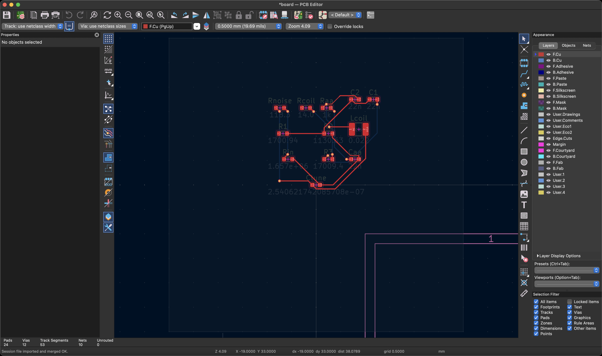
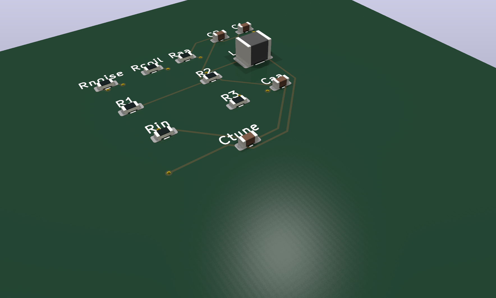
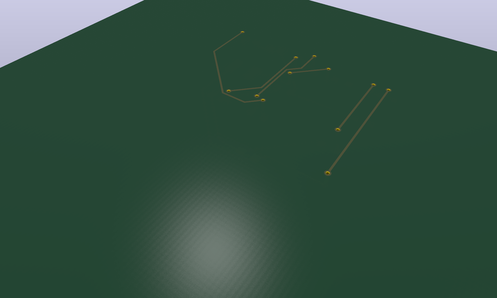

# Proton Magnetometer Pipeline

- ECE 455
- Week3 design status

---

# Proton magnetometer background

- Measures magnetic field
- Polarization coil aligns water protons
- Pulse turns off
- Protons precess in Earth’s field
- Sensing coil receives a tiny voltage

---

# Frequency measures field

- Precession frequency depends on field strength
- 50 µT produces about 2.13 kHz
- Frequency error becomes field error
- Small signal errors matter

---

# Why the signal is difficult

- Signal: about microvolts
- Noise: coil, amplifier, supply, interference
- Pulse ringing can hide the signal
- Incorrect frequency gives incorrect field

---

# Auto-research background

- Common loop
  - Agent proposes a change
  - Evaluator measures the result
  - Better changes are kept
- AlphaEvolve (Novikov et al., 2025) [1]
  - Agent changes algorithm code
  - Evaluators provide selection feedback
  - Found a faster data-center scheduler and improved 4 × 4 complex matrix multiplication
- Karpathy autoresearch (Karpathy, 2026) [2]
  - Agent edits one training file
  - Each trial trains for five minutes
  - Validation bits per byte decides whether to keep the change
- AutoHarness (Lou et al., 2026) [3]
  - Agent builds and refines a code harness
  - Environment feedback finds invalid behavior
  - Harness prevented illegal moves in 145 text-game environments
- References
  - [1] Novikov et al. (2025). [AlphaEvolve](https://arxiv.org/abs/2506.13131)
  - [2] Karpathy (2026). [autoresearch](https://github.com/karpathy/autoresearch)
  - [3] Lou et al. (2026). [AutoHarness](https://arxiv.org/abs/2603.03329)

---

# Why use a pipeline?

- Hand calculations miss interactions
- Tuning can amplify signal and power ripple
- One path tests coil through field estimate
- Same method compares all proposals

---

# System being optimized

- Receiver after the sensing coils
- Input: coil signal and impedance
- Input: amplifier noise, gain, and filter
- Input: ADC range and resolution
- Input: estimator and clock
- Output: one magnetic-field estimate

---

# Week3 coil inputs

- Polarizer: 360 turns and 3 A
- Modeled polarizer field: 9.38 mT
- Two sensing coils: 6 × 6 cm
- 552 turns per sensing coil
- Sensing pair: 14 Ω and 22 mH
- Tuning capacitor: 264 nF
- Provisional signal decay: 0.95 s

---

# Circuit proposal files

- Circuit description: Python `.py`
- Simulation netlist: SPICE `.cir`
- Simulation results: text tables
- Schematic: KiCad `.kicad_sch`
- Board layout: KiCad `.kicad_pcb`

---

# Firmware files

- Estimator source: C `.c` and `.h`
- Python creates synthetic ADC samples
- Compiled C code estimates frequency
- Same estimator is intended for hardware

---

# Simulation step

- SPICE calculates gain and noise
- SPICE finds resonance and bandwidth
- SPICE estimates ring-down
- Pipeline creates filtered ADC records
- Records include random noise and ripple

---

# Working simulation design

- One receiver with five switched states
- Fixed Week3 sensing pair: 14 Ω and 22 mH
- 2N6550-class JFET noise model
- Preamp gain: 4 V/V
- Recentered bandpass and anti-alias filter
- 16-bit, 2.048 V ADC model
- Zoom estimator and 0.5 ppm clock

---

# Why the receiver switches states

- Field range: 25 to 65 µT
- FID range: 1.06 to 2.77 kHz
- One high-Q tank cannot cover this range
- Capacitor bank retunes the sensing pair
- Resistor bank recenters the bandpass
- One state is selected before each capture

---

# Receiver tuning states

- 25 µT: 1016 nF
- 37.5 µT: 452 nF
- 50 µT: 254 nF
- 62 µT: 165 nF
- 65 µT: 150 nF
- Each state is tuned to its Larmor frequency

---

# LTspice receiver circuit

- 50 µT tuning state
- Week3 sensing-pair model
- Tuned input and JFET noise
- Preamp, bandpass, anti-alias, and ADC stages
- Pipeline-equivalent circuit with ideal gain blocks
- Files: [schematic](assets/week3-working-receiver-50ut.asc) and [netlist](assets/week3-working-receiver-50ut.cir)

---

# LTspice amplification response

- Transfer: `V(adc) / V(nin)`
- Left axis: gain magnitude
- Right axis: phase
- Peak: 45.7 dB, or 192 V/V
- Peak frequency: 2.12 kHz
- −3 dB band: 1.74 to 2.58 kHz
- File: [AC schematic](assets/week3-working-receiver-50ut-transfer.asc)

---

# LTspice receiver waveform

- 50 µT state
- Blue: tuned-coil voltage
- Green: ADC input voltage
- Includes synthetic FID and 2 kHz ripple

---

# PCB autorouting

- KiCad exports a Specctra DSN file
- FreeRouting 2.4.1 creates a routed session
- KiCad imports tracks and vias
- Unrouted connections: 14 to 0
- KiCad DRC violations: 0
- This routes the passive demonstration only
- Files: [routed board](assets/week3-working-pcb/board-routed.kicad_pcb) and [DRC report](assets/week3-working-pcb/board-routed-drc.txt)

---

# PCB front copper layer

- Components are placed on the front
- Front copper track segments: 41
- Vias connect tracks to the back layer
- Autorouted traces are visible through the mask

---

# PCB back copper layer

- No components are placed on the back
- Back copper track segments: 12
- Through-vias: 12
- All routed traces are visible

---

# PCB fabrication preview

- Auto-generated and autorouted KiCad board
- 50 µT receiver passives placed
- Routed Gerber, drill, and STEP export succeeded
- Passive-board DRC passes
- Ideal gain blocks and sources have no footprints
- Amplifier, switches, ADC, and connectors remain to be added

---

# Optimization result

- One Grok 4.6 proposal iteration
- 40 noisy trials per state
- Worst RMS error: 0.026 nT
- Target: less than 1 nT
- All simulated performance gates pass
- Reproduce: `python tools/run_working_demo.py`

---

# What the result proves

- SPICE response drives synthetic ADC records
- C firmware estimates each FID frequency
- Field error is measured at five field values
- Ripple, clipping, recovery, and clock are gated
- The pipeline can identify a passing simulation

---

# Qualification boundary

- Result assumes the simulated coil is correct
- Production score remains infinite
- Open gate: hardware characterization
- Switch parasitics are not scored
- Real 3 A turnoff is not simulated
- This is not hardware validation

---

# Estimation step

- C firmware reads each ADC record
- Firmware estimates FID frequency
- Pipeline repeats with random noise
- Frequency error becomes field error
- 0.042576 Hz equals 1 nT

---

# How a proposal is graded

- Score: worst field RMS error from 25 to 65 µT
- Lower score is better
- Failed gate gives infinite score
- Only passing proposals can be ranked

---

# Grading gates

- ADC clipping: signal must fit the ADC
- Ring-down: receiver must recover quickly
- Gross error: estimator must find the FID
- Rail ripple: supply noise must not corrupt the FID
- Clock bias: timing error must stay below 0.1 nT
- Hardware characterization: coil assumptions must be measured

---

# Work completed

- One end-to-end scoring path
- SPICE circuit simulation
- C estimator inside the scoring loop
- Clipping, ringing, ripple, and clock gates
- Week3 coil profile
- Five-state working simulation proposal
- One Grok 4.6 optimization iteration
- Regression tests
- Historical results kept separately

---

# Current status

- Ready for simulation and test planning
- Not ready to select a receiver
- Switched proposal passes modeled gates
- Coil-pair connection is unverified
- Mutual coupling is unmeasured
- 3 A turnoff recovery is unmeasured
- Switch behavior is unmodeled

---

# Next steps

- Model the capacitor and resistor switches
- Add real amplifier and protection models
- Add missing PCB footprints and reroute the full board
- Build and measure the sensing pair
- Measure resistance, inductance, resonance, and Q
- Measure ring-down after a 3 A pulse
- Capture a real FID
- Measure FID amplitude and T2*
- Measure supply ripple and rejection
- Update model and rerun optimization
