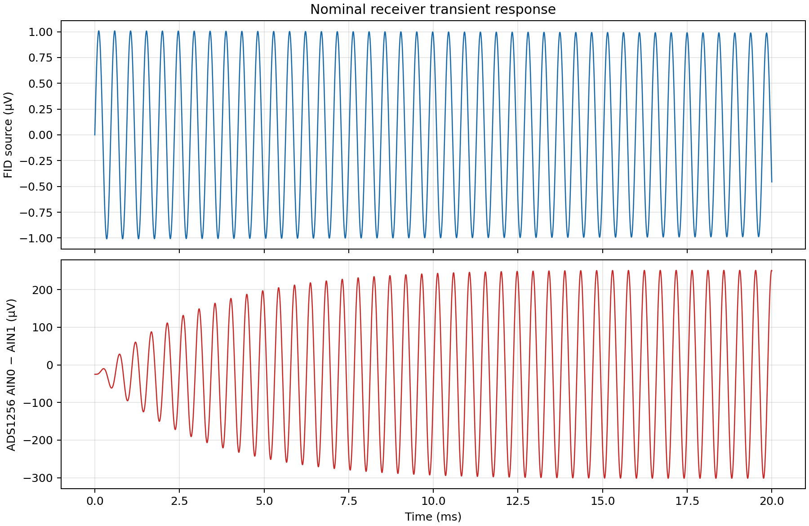
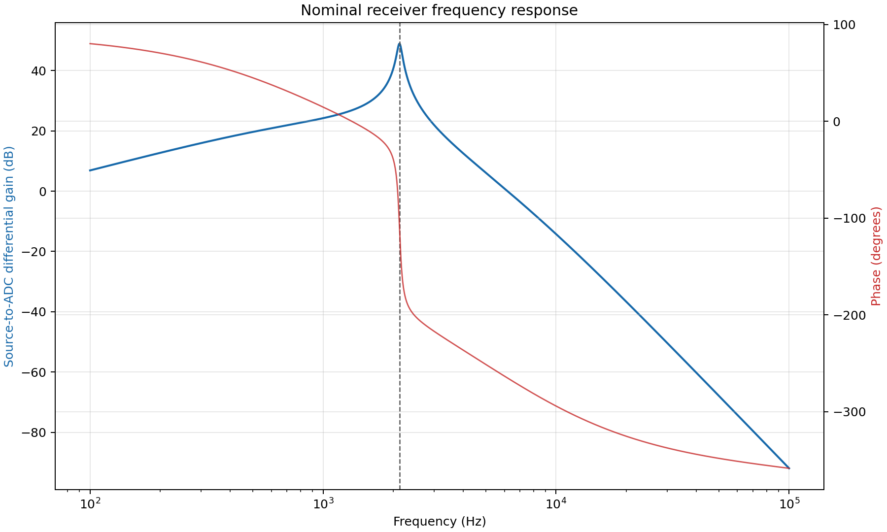

# Generated receiver analysis

Generated by `python3 receiver_design/analyze.py` using ngspice and Matplotlib. Values are simulated, not measured.

- Analysis netlist: `spice/receiver.cir`
- Nominal resonance marker: 2128.795 Hz
- Gain near resonance: 48.93 dB (279.6 V/V)
- Settled input peak: 0.998 µV
- Settled ADC differential peak about its mean: 278.7 µV

